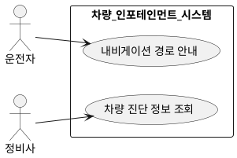
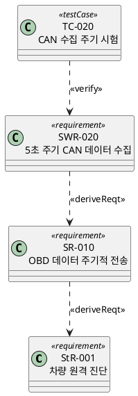
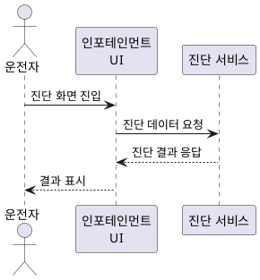
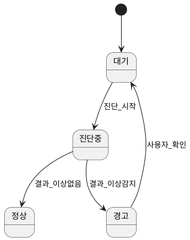
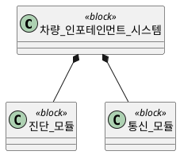

# PlantUML로 UML/SysML 다이어그램 작성하기

기능 요구사항을 표현할 다이어그램 종류를 고르는 기준과 PlantUML 예시 문법이다. 실제 렌더링은
PlantUML 뷰어/플러그인이 필요하므로, `.puml` 파일로 저장하고 경로를 문서에서 참조한다.

## 다이어그램 선택 기준

| 상황 | 추천 다이어그램 |
|---|---|
| 기능 요구사항의 전체 범위와 액터를 한눈에 보여줄 때 | 유스케이스 다이어그램 |
| 여러 컴포넌트/액터 간 상호작용 순서를 보여줄 때 | 시퀀스 다이어그램 |
| 상태 전이·모드 변화가 있는 요구사항일 때 | 상태 다이어그램 |
| 시스템 구조(블록, 구성요소, 인터페이스)를 보여줄 때 | 블록 정의 다이어그램(BDD)/내부 블록 다이어그램(IBD) |
| 요구사항 간 파생/충족/검증 관계를 보여줄 때 | SysML 요구사항 다이어그램 |

## 1. 유스케이스 다이어그램

## 2. SysML 요구사항 다이어그램 (스테레오타입 방식)

SysML은 UML 프로파일 확장이므로, PlantUML 클래스 다이어그램에 `<<requirement>>`,
`<<block>>` 스테레오타입과 `<<deriveReqt>>`, `<<satisfy>>`, `<<verify>>`, `<<refine>>` 관계를
붙여서 표현한다. 이 관계는 `references/traceability-matrix.md`의 내용과 반드시 일치해야 한다.

## 3. 시퀀스 다이어그램 (이벤트 기반 요구사항)

## 4. 상태 다이어그램 (상태 기반 요구사항)

## 5. 블록 정의 다이어그램 (구조 요구사항)

## 작성 시 유의사항

- 다이어그램은 요구사항 문서를 대체하지 않는다 — 항상 관련 요구사항 ID(StR/SR/SWR)를 다이어그램
  요소 이름에 함께 표기해서, 문서와 다이어그램이 서로 상호 참조 가능하게 한다.
- 다이어그램에서만 존재하는 관계(매트릭스에 없는 파생/충족/검증 관계)나 그 반대는 일관성 오류로
  취급하고 둘 중 하나를 수정한다.
